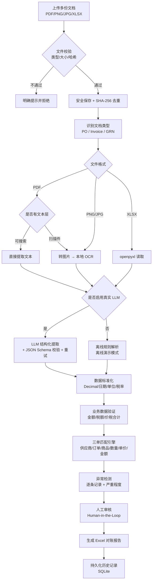
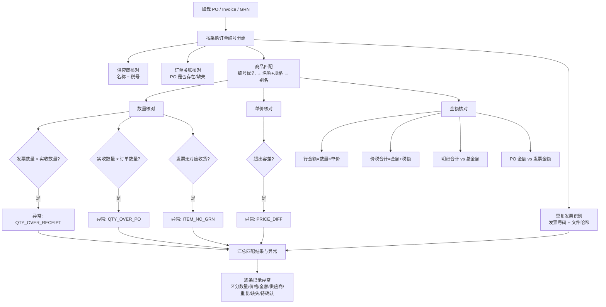
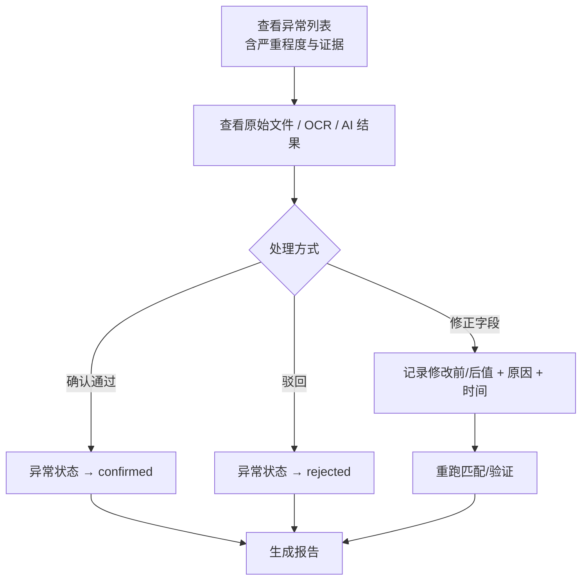
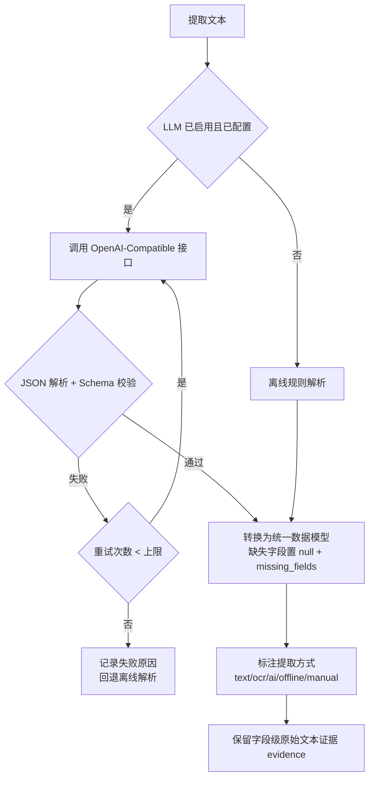

# 系统业务流程（Mermaid）

## 1. 端到端主流程

```mermaid
flowchart TD
    A[上传多份文档<br/>PDF/PNG/JPG/XLSX] --> B{文件校验<br/>类型/大小/哈希}
    B -->|不通过| B1[明确提示并拒绝]
    B -->|通过| C[安全保存 + SHA-256 去重]
    C --> D[识别文档类型<br/>PO / Invoice / GRN]
    D --> E{文件格式}
    E -->|PDF| E1{是否有文本层}
    E1 -->|可搜索| F1[直接提取文本]
    E1 -->|扫描件| F2[转图片 → 本地 OCR]
    E -->|PNG/JPG| F2
    E -->|XLSX| F3[openpyxl 读取]
    F1 --> G
    F2 --> G
    F3 --> G
    G{是否启用真实 LLM}
    G -->|是| H1[LLM 结构化提取<br/>+ JSON Schema 校验 + 重试]
    G -->|否| H2[离线规则解析<br/>离线演示模式]
    H1 --> I[数据标准化<br/>Decimal/日期/单位/税率]
    H2 --> I
    I --> J[业务数据验证<br/>金额/税额/价税合计]
    J --> K[三单匹配引擎<br/>供应商/订单/商品/数量/单价/金额]
    K --> L[异常检测<br/>逐条记录 + 严重程度]
    L --> M[人工审核<br/>Human-in-the-Loop]
    M --> N[生成 Excel 对账报告]
    N --> O[持久化历史记录<br/>SQLite]
```

## 2. 三单匹配引擎流程

```mermaid
flowchart TD
    S[加载 PO / Invoice / GRN] --> A[按采购订单编号分组]
    A --> B[供应商核对<br/>名称 + 税号]
    A --> C[订单关联核对<br/>PO 是否存在/缺失]
    A --> D[商品匹配<br/>编号优先 → 名称+规格 → 别名]
    D --> E[数量核对]
    E --> E1{发票数量 > 实收数量?}
    E1 -->|是| A1[异常: QTY_OVER_RECEIPT]
    E --> E2{实收数量 > 订单数量?}
    E2 -->|是| A2[异常: QTY_OVER_PO]
    E --> E3{发票无对应收货?}
    E3 -->|是| A3[异常: ITEM_NO_GRN]
    D --> F[单价核对]
    F --> F1{超出容差?}
    F1 -->|是| A4[异常: PRICE_DIFF]
    D --> G[金额核对]
    G --> G1[行金额=数量×单价]
    G --> G2[价税合计=金额+税额]
    G --> G3[明细合计 vs 总金额]
    G --> G4[PO 金额 vs 发票金额]
    A --> H[重复发票识别<br/>发票号码 + 文件哈希]
    A1 --> R[汇总匹配结果与异常]
    A2 --> R
    A3 --> R
    A4 --> R
    H --> R
    R --> O[逐条记录异常<br/>区分数量/价格/金额/供应商/重复/缺失/待确认]
```

## 3. 人工审核流程

```mermaid
flowchart TD
    A[查看异常列表<br/>含严重程度与证据] --> B[查看原始文件 / OCR / AI 结果]
    B --> C{处理方式}
    C -->|修正字段| D[记录修改前/后值 + 原因 + 时间]
    C -->|确认通过| E[异常状态 → confirmed]
    C -->|驳回| F[异常状态 → rejected]
    D --> G[重跑匹配/验证]
    E --> H[生成报告]
    F --> H
    G --> H
```

## 4. AI 信息提取流程

```mermaid
flowchart TD
    A[提取文本] --> B{LLM 已启用且已配置}
    B -->|是| C[调用 OpenAI-Compatible 接口]
    B -->|否| D[离线规则解析]
    C --> E{JSON 解析 + Schema 校验}
    E -->|失败| F{重试次数 < 上限}
    F -->|是| C
    F -->|否| G[记录失败原因<br/>回退离线解析]
    E -->|通过| H[转换为统一数据模型<br/>缺失字段置 null + missing_fields]
    D --> H
    H --> I[标注提取方式<br/>text/ocr/ai/offline/manual]
    I --> J[保留字段级原始文本证据 evidence]
```
